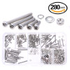
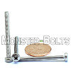
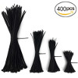
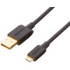
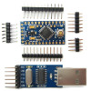
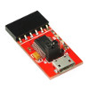
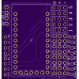
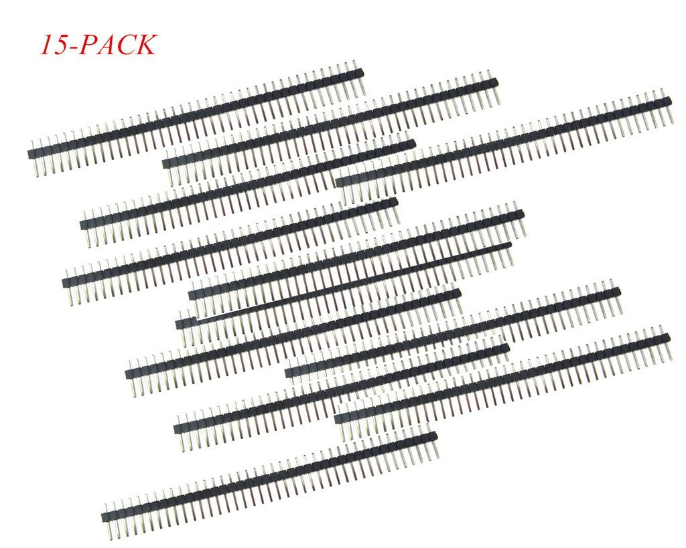
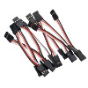

# Donkey Self-Driving Car

This instructable shows off how to create a [DIY Robocar](https://diyrobocars.com/) forked off of the ["Donkey"](https://www.donkeycar.com/) Self-Driving car platform using the OpenMV Cam instead of the RaspberryPi. You can see the car in action in this video [here](https://youtu.be/Pm88BEz3upM).

## Parts

The OpenMV Cam Donkey Car is designed to be easy to build out of parts that you can buy online and assemble together with basic tools. Below is the list of essential parts you'll need to build the self-driving car.

Part Description | Part Link | Part Count | Part Cost
---------------- | --------- | ---------- | ---------
1/16 2.4Ghz Exceed RC Magnet Car  | https://www.amazon.com/2-4Ghz-Exceed-RC-Magnet-Electric/dp/9269803775 | 1 | $79.95
Magenet Car Base Plate  | https://www.shapeways.com/product/6YD3XR9ND/magnet-car-base-plate  You can download the STL file for this part at https://www.shapeways.com/product/download/6YD3XR9ND  *Magnet Base Plate by Adam Conway*. | 1 | $55.10
Magnet Car Roll Cage  | https://www.shapeways.com/product/74VXFV7AT/magnet-car-roll-cage  You can download the STL file for this part at https://www.shapeways.com/product/download/74VXFV7AT  *Magnet Car Roll Cage by Adam Conway*. | 1 | $66.92
OpenMV Cam Donkey Mount  | https://www.shapeways.com/product/G7YQBUMRC/openmv-cam-donkey-mount  You can download the STL file for this part at https://www.shapeways.com/product/download/G7YQBUMRC  *OpenMV Cam Donkey Mount by Chris Anderson*. | 1 | $21.18
M2 Machine Screw Set  | https://www.amazon.com/Glarks-280-Pieces-Phillips-Stainless-Assortment/dp/B01G0KRGXC | 1 | $11.89
M3 35mm Machine Screws  | https://www.amazon.com/M3-3mm-0-50-Stainless-MonsterBolts/dp/B016YZTEB0 | 1 | $4.00
M3 Machine Screw Nuts  | https://www.amazon.com/M3-0-5-3mm-Metric-Stainless-MonsterBolts/dp/B01528BPIU | 1 | $3.49
30 CM Servo Lead Extension Assemblies  | https://hobbyking.com/en_us/30cm-servo-lead-extention-jr-with-hook-26awg-5pcs-bag-1.html | 1 | $1.39
OpenMV Cam M7  | https://openmv.io/products/openmv-cam-m7  Note: You will need a soldering iron and solder to attach the pin headers for this part. | 1 | $65.00
OpenMV Cam Servo Shield  | https://openmv.io/products/servo-shield  Note: You will need a soldering iron and solder to attach the pin headers for this part. | 1 | $15.00
Zip Ties  | https://www.amazon.com/Cable-Zip-Ties-Fastening-Organization/dp/B01LPOB2JW | 1 | $9.99
Micro USB Cable  | https://www.amazon.com/AmazonBasics-USB-Male-Micro-Cable/dp/B01EK87T9M | 1 | $5.99

**Sub-Total $339.90** - However, if you can 3D print parts it's significantly cheaper to build the robocar. You may also have some of the above parts lying around (like the Micro USB cable).

While the above parts list is all you need you may wish to instead control your robocar's servos using the below parts for an arduino based servo controller board which will allow you to control your robot remotely using the RC transmitter that comes with the magnet car. You don't need the servo shield above if you build your car using the below components.

Part Description | Part Link | Part Count | Part Cost
---------------- | --------- | ---------- | ---------
5V 16 MHz Arduino Pro Mini  | https://www.amazon.com/Arducam-Atmega328-Development-Compatible-Arduino/dp/B01981EBBA | 1 | $6.49
Arduino Pro Mini Programmer  | https://www.amazon.com/Micro-Basic-Breakout-Module-Arduino/dp/B00N4MCS1A | 1 | $9.95
Servo Controller Board  | https://oshpark.com/shared_projects/2bKUWmbq  You can download the Gerber files for this part at https://644db4de3505c40a0444-327723bce298e3ff5813fb42baeefbaa.ssl.cf1.rackcdn.com/ab7a7db45c3c6b37bcca1d8fc84e26e4.zip  *Servo Controller Board by Chris Anderson*. | 1 | $10.50 
Male Headers  | https://www.amazon.com/SamIdea-15-Pack-Straight-Connector-Prototype/dp/B01M9FCAXW  Note: You will need a soldering iron and solder to attach these pin headers to the above PCB. | 1 | $5.69
8-pin Stackable Headers  | https://www.amazon.com/Venel-Electronic-Component-Stackable-Shields/dp/B071454KP1  Note: You will need a soldering iron and solder to attach these pin headers to the above PCB. | 1 | $5.08
RC Receiver Servo Adapters  | https://www.amazon.com/Hobbypower-Futaba-Servo-Extension-Cable/dp/B00RVDVWTC | 1 | $4.49
Mini USB Cable  | https://www.amazon.com/AmazonBasics-USB-2-0-Cable-Male/dp/B00NH11N5A | 1 | $5.49

**Sub-Total $47.69** - You may have some of the above parts lying around (like the Mini USB cable).

In addition to all of the above I **heavily** recommend that your purchase a wide angle lens for your OpenMV Cam. With the wide angle lens it's much easier for your self-driving car to make tight turns and not loose sight of the road ahead. Without it you *will* have to reduce your maximum speed in-order to make tight turns.

Part Description | Part Link | Part Count | Part Cost
---------------- | --------- | ---------- | ---------
OpenMV Cam Wide Angle Lens  | https://openmv.io/products/ultra-wide-angle-lens | 1 | $15.00

**Sub-Total $15.00**

Moving on, for better performance I recommend that you purchase LiPo batteries, adapters, and a LiPo charger. The NiMh battery that comes with the Magnet Car will quickly run out of power making it hard for you to test for hours before a race on the same day.

Part Description | Part Link | Part Count | Part Cost
---------------- | --------- | ---------- | ---------
Turnigy 1300mAh 2S 20C LiPo Pack  | https://hobbyking.com/en_us/turnigy-1300mah-2s-20c-lipo-pack-suit-1-18th-truck.html | 3 | $10.03
Tamiya Mini Female to XT60 Male Adapters  | https://hobbyking.com/en_us/female-mini-tamiya-gt-male-xt60-3pcs-bag.html | 1 | $3.36
Turnigy E3 Compact 2S/3S Lipo Charger  | https://hobbyking.com/en_us/turnigy-e3-compact-2s-3s-lipo-charger-100-240v-us-plug.html | 1 | $12.35

**Sub-Total $45.77**

Finally, for wireless programming I recommend that you purchase a WiFi shield for the OpenMV Cam. With the WiFi shield you'll be able to comfortably test your self-driving car from one position versus having to follow your car around tethered by a USB cable.

Part Description | Part Link | Part Count | Part Cost
---------------- | --------- | ---------- | ---------
OpenMV Cam WiFi Shield  | https://openmv.io/products/wifi-shield | 1 | $35.00

*Note, as of 8/15/2017 wireless programming has not yet been implemented for the OpenMV Cam but it is comming soon.*

**Sub-Total $35.00**
