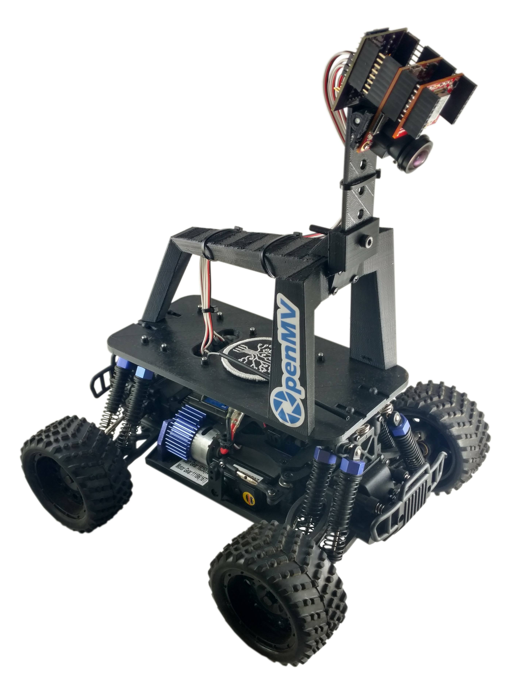
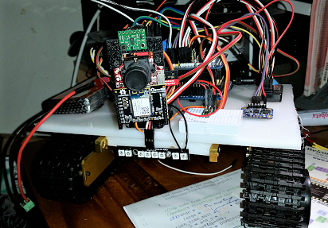
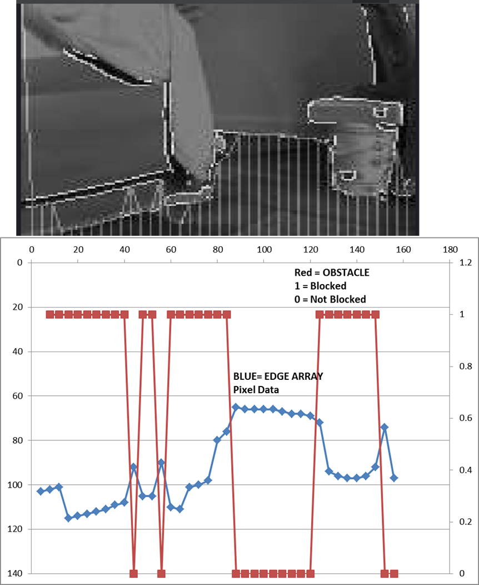
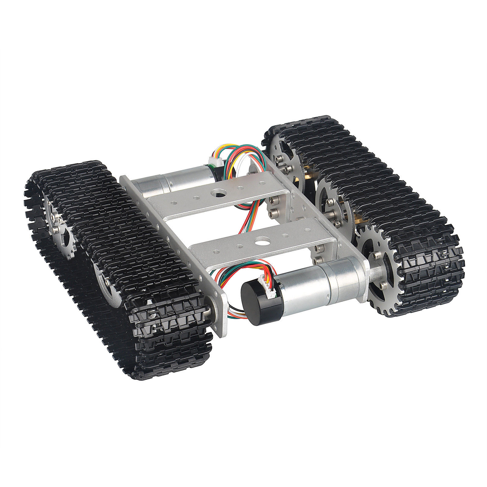

# OpenMV Robotics Projects

Complete robotics builds that use the OpenMV Cam as the primary perception system. The camera runs MicroPython on-board — no desktop PC required during operation — and communicates with a microcontroller over UART or I2C to drive motors, servos, and other actuators.

---

## [Donkey Self-Driving Car](donkey-car/README.md)

An [OpenMV Cam](https://openmv.io)-powered build of the [Donkey Car](https://www.donkeycar.com/) platform — a 1/10-scale RC car converted to run autonomous laps around a track using a trained neural network.

The OpenMV Cam replaces the standard Raspberry Pi camera, providing a compact self-contained vision system. A custom 3D-printed roll cage and camera mount fit the OpenMV Cam directly onto the standard Donkey Car chassis. A line-follower mode is also included that runs entirely on-camera without a host PC.

**Includes:**
- 3D-printable parts: roll cage, camera mount, and magnet plate (STL files in `download/`)
- Step-by-step build photo guide (40+ steps)
- `line_follower_main.py` — on-camera line following script
- PCA9685 servo driver and servo controller Arduino sketch

---

## [Autonomous Rover](autonomous-rover/README.md)

A tracked rover that uses monocular edge detection on the OpenMV Cam to navigate obstacle-free corridors without any external sensors for vision. A Teensy 3.5 handles all motor control, orientation, and odometry while the OpenMV Cam finds the widest gap ahead and reports its angular position over UART.

The detection algorithm identifies the largest contiguous horizontal gap in a Canny edge map, finds its center of mass, and converts it to an angle within the camera's field of view. The Teensy then uses a VL53L0X TOF sensor and BNO055 IMU to execute the turn and track distance traveled before requesting the next frame analysis.

**Hardware:**
- OpenMV Cam (vision + UART)
- Teensy 3.5 (motion control, odometry)
- VL53L0X TOF sensor (close-range fallback distance)
- BNO055 IMU (turn control)
- Tracked aluminum chassis with Hall effect odometry sensors
- Adafruit Motor Shield V2

