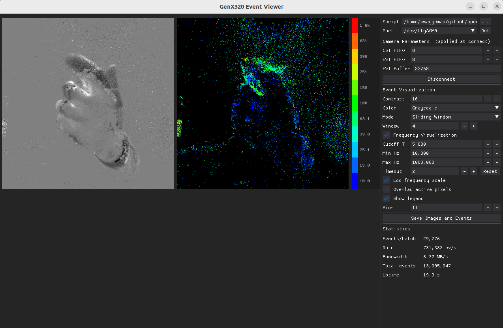
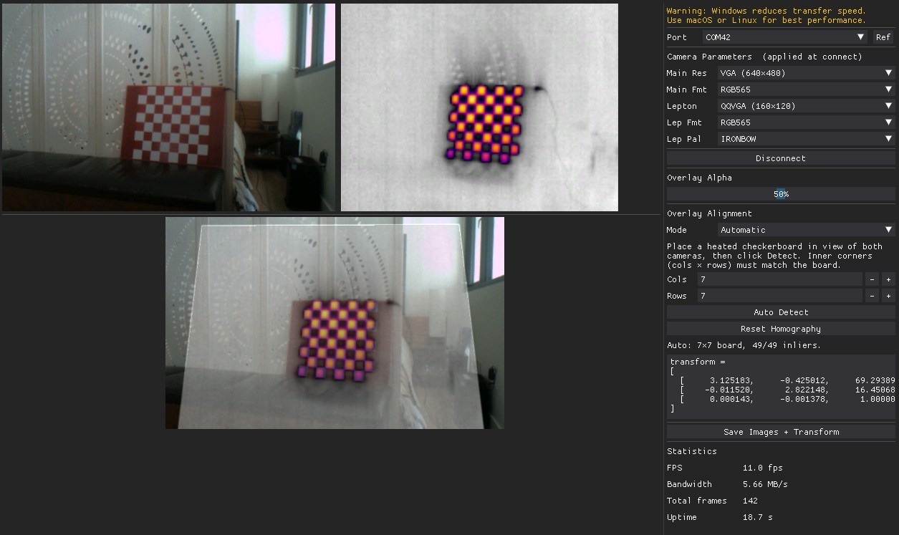

# OpenMV PC Tools

Desktop GUI applications that pair with an OpenMV Cam over USB serial. Each tool runs a companion MicroPython script on the camera that handles capture and streaming, while the PC side provides real-time visualization, analysis, and parameter tuning.

All tools are built with [DearPyGui](https://github.com/hoffstadt/DearPyGui) and communicate with the camera via the [openmv](https://pypi.org/project/openmv/) Python package.

> **Platform note:** macOS and Linux give the best performance. On Windows, GUI rendering and USB transfer throughput can be lower, which may reduce frame or event rates at high data volumes.

---

## [GenX320 Event Streaming](genx320-event-streaming/README.md)

Real-time streaming and visualization for the [Prophesee GenX320](https://www.prophesee.ai/event-camera-genx320/) event camera sensor attached to an OpenMV Cam. Events are displayed as an accumulation canvas alongside a per-pixel frequency map computed in real time using a second-order IIR bandpass filter (FrequencyCam algorithm).



**Key features:**
- Dual visualization: event canvas + frequency heatmap side by side
- Raw streaming mode (default) sends unprocessed 4-byte EVT 2.0 words vs 12-byte decoded structs — 3× less data over USB
- Adaptive layout that maximizes image size as the window resizes
- Colorbar legend with log or linear frequency scale
- Save event CSV and frequency PNG to disk
- Configurable FIFO depths, event buffer size, contrast, and colormap

```
pip install dearpygui numpy pyserial Pillow openmv
python genx320-event-streaming/genx320_event_mode_streaming_on_pc.py
```

---

## [Thermal Overlay Calibration](thermal-overlay-calibration/README.md)

Streams color and thermal (FLIR Lepton) frames simultaneously and composites them into a calibrated overlay. Supports manual 4-point picking or automatic heated-checkerboard detection to compute a perspective homography for pixel-accurate alignment.



**Key features:**
- Dual live preview: main camera + Lepton side by side at matched display height
- Composite view with adjustable alpha blending (0–100%)
- Manual alignment: click 4 matching landmarks on each image
- Automatic alignment: heated checkerboard detection with CLAHE, Otsu thresholding, per-channel analysis, and RANSAC homography using all corners
- Configurable pixel format (RGB565/GRAYSCALE) and color palette (IRONBOW/RAINBOW) per camera
- Copyable 3×3 transform matrix displayed after calibration
- Save main, Lepton, composite PNGs and transform TXT to disk

```
pip install dearpygui numpy pyserial Pillow openmv opencv-python
python thermal-overlay-calibration/thermal_overlay_calibration_on_pc.py
```

---

## [GenX320 Overlay Calibration](genx320-overlay-calibration/README.md)

Streams a color frame and a 320×320 grayscale histogram frame from the GenX320 event camera simultaneously and composites them into a calibrated overlay. Supports manual 4-point picking or automatic checkerboard detection to compute a perspective homography for pixel-accurate alignment.

**Key features:**
- Dual live preview: main camera + GenX320 histogram side by side at matched display height
- Composite view with adjustable alpha blending (0–100%)
- Manual alignment: click 4 matching landmarks on each image
- Automatic alignment: checkerboard detection with CLAHE, Otsu thresholding, per-channel analysis, and RANSAC homography using all corners
- GenX320 always operates in histogram mode (320×320 grayscale) — no format controls needed
- Copyable 3×3 transform matrix displayed after calibration
- Save main, GenX320, composite PNGs and transform TXT to disk

```
pip install dearpygui numpy pyserial Pillow openmv opencv-python
python genx320-overlay-calibration/genx320_overlay_calibration_on_pc.py
```

---

## [CCM Tuning](ccm-tuning/README.md)

An interactive Color Correction Matrix (CCM) tuner for the OpenMV N6 camera. Streams raw Bayer frames over USB and applies a full software replica of the N6 ISP pipeline — debayer, black level, auto white balance, CCM, brightness/contrast/gamma — so you can tune every parameter live without reflashing.


**Key features:**
- Live ISP pipeline: Raw Bayer → Debayer → Black Level → AWB → CCM → BCG
- ColorChecker Classic solver: click four corners, get a least-squares CCM instantly
- Multi-illuminant workflow: solve under each light source, record R/G and B/G ratios for piecewise interpolation in firmware
- Save processed frame (BMP) and full pipeline state (TXT) to disk

```
pip install dearpygui opencv-python numpy pyserial Pillow openmv
python ccm-tuning/ccm_tuning_on_pc.py
```
