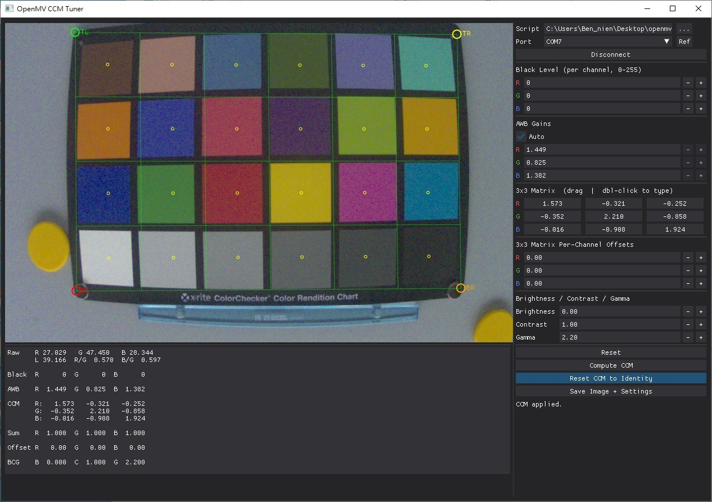

# CCM Tuning GUI for OpenMV N6

A PC-side GUI tool for tuning the Color Correction Matrix (CCM) and related ISP parameters for the OpenMV N6 camera. It streams raw Bayer frames from the camera over USB serial, applies a software replica of the N6 ISP pipeline in real time, and displays the corrected image alongside live statistics.



## Platform Notes

macOS and Linux are recommended for the best GUI performance and frame throughput. On Windows, DearPyGui rendering can be noticeably slower, which may reduce the effective frame rate. The camera script and serial protocol work on all platforms, but if you experience a sluggish UI or low frame rate, consider switching to a Mac or Linux machine.

On macOS and Linux the companion script's `read` method is automatically renamed to `readp` before execution (this is handled transparently by the PC script).

CRC is disabled by default on macOS and Linux for better USB throughput. It is enabled by default on Windows where it improves reliability. Override with `--crc`.

## ISP Pipeline

The tool mimics the N6 ISP pipeline in this order:

```
Raw Bayer → Debayer → Black Level Correction → AWB → CCM → BCG (Brightness / Contrast / Gamma LUT)
```

All parameters are applied in software on the PC so you can tune them interactively without reflashing the camera.

## Prerequisites

1. **OpenMV IDE** v4.8.4 or later — used to initially set up the camera firmware.
2. **OpenMV Cam Firmware** v5.0.0 or later.
3. **Python dependencies:**

```
pip install dearpygui opencv-python numpy pyserial Pillow openmv
```

## Running

```
python ccm_tuning_on_pc.py
```

The companion camera script (`ccm_tuning_on_cam.py`, located in the same folder) is loaded automatically. You can override any option from the command line:

| Flag | Default | Description |
|------|---------|-------------|
| `--port PORT` | *(GUI selector)* | Serial port to connect on |
| `--script PATH` | `ccm_tuning_on_cam.py` | MicroPython script to run on the camera |
| `--baudrate N` | `921600` | Serial baud rate |
| `--crc` | off (Linux/Mac), on (Windows) | Enable CRC on the serial protocol |
| `--seq` | on | Enable sequence numbers |
| `--ack` | off | Enable per-packet ACKs |
| `--quiet` | off | Suppress camera stdout |
| `--debug` | off | Enable verbose logging |
| `--benchmark` | off | Headless throughput benchmark (no GUI) |

## Benchmark Mode

Run without the GUI to measure raw USB frame throughput:

```
python ccm_tuning_on_pc.py --benchmark
python ccm_tuning_on_pc.py --benchmark --port /dev/ttyACM0
```

Prints at 10 Hz:

```
elapsed=4.1s    fps=12.3    bw=3.76 MB/s    res=640x480    total=50 frames
```

Press **Ctrl+C** to stop.

## GUI Overview

### Connection Bar (top of right panel)

- **Script** — path to the MicroPython script that runs on the camera. Click the folder icon to browse.
- **Port** — serial port drop-down. Hit the **R** button to refresh the list.
- **Connect / Disconnect** — starts or stops the camera worker thread.

### Live Stats Display

A read-only selectable text box showing the current ISP state on every frame:

```
Raw    R  56.5   G  88.4   B  70.2
       L  76.8  R/G  0.639  B/G  0.793

Black  R      0  G      0  B      0

AWB    R  1.359  G  0.869  B  1.095

CCM    R:   1.479   -0.449   -0.030
       G:  -0.318    1.280    0.038
       B:  -0.086   -0.880    1.966

Sum    R  1.000  G  1.000  B  1.000

Offset R   0.00  G   0.00  B   0.00

BCG    B  0.000  C  1.000  G  2.200
```

- **Raw** — mean R/G/B of the raw Bayer frame before any processing. **L** is luminance. **R/G** and **B/G** are the raw channel ratios — these are the illuminant fingerprint used for piecewise CCM interpolation across different light sources.
- **Black** — black level subtracted per channel.
- **AWB** — auto white balance gains (or manual gains when AWB is set to manual).
- **CCM** — the 3×3 color correction matrix currently applied.
- **Sum** — row sums of the CCM (should be 1.000 for each row when correctly normalized).
- **Offset** — per-channel additive offset applied after the CCM.
- **BCG** — brightness, contrast, and gamma values applied via a LUT.

### Black Level

Per-channel (R, G, B) integer black level offsets subtracted from the raw frame before debayering.

### Auto White Balance

- **Auto** checkbox — when enabled, AWB gains are computed automatically each frame from the raw channel means and displayed live.
- **R / G / B gain** sliders — when Auto is off, set manual gains here.

### 3×3 Matrix Per-Channel Offsets

The CCM is a 3×3 matrix where each row applies to one output channel (R, G, B). Rows are color-coded. Each row should sum to 1 (achromatic constraint). The per-channel offsets below the matrix add a fixed bias after the CCM multiply.

### BCG (Brightness / Contrast / Gamma)

- **B** — brightness offset (additive, applied before contrast).
- **C** — contrast multiplier.
- **G** — gamma exponent (no upper limit; values > 1 darken midtones, < 1 brighten midtones).

### ColorChecker CCM Solver (bottom of right panel)

Used to automatically compute a CCM from a physical X-Rite ColorChecker Classic card placed in front of the camera.

#### Workflow

1. Place the ColorChecker Classic card in the camera's field of view under the target light source.
2. Click **Pick ColorChecker** — the button changes to **Reset** while picking is active.
3. Click the **four outer corners of the card** in order: top-left → top-right → bottom-right → bottom-left. The status line guides you through each click. A green grid overlay appears showing the 24 patch cells with yellow dots at each patch center.
4. Click **Compute CCM** — the tool samples the pre-CCM (post-AWB) frame at each patch center, runs a least-squares solve against the X-Rite D65 reference values, normalizes the result so each row sums to 1, and writes it into the CCM matrix fields immediately.
5. The grid overlay stays visible so you can verify the patch alignment. Click **Reset** (was Pick ColorChecker) to clear the corners and start over.
6. Click **Reset CCM to Identity** at any time to restore the CCM to the identity matrix (no color correction).

> **Tip for multi-illuminant tuning:** Repeat the ColorChecker solve under each target light source (e.g. TL84 ~3800 K, D65 ~6700 K). Record the solved CCM and the **R/G** and **B/G** raw ratios for each. These ratios are the illuminant fingerprint (measured before AWB normalizes them) and can be used to build a piecewise linear interpolation table between CCMs in firmware.

### Save Image + Settings

Saves the current processed frame and all ISP parameters to disk:

- `ccm_frame_<timestamp>.bmp` — the displayed (post-BCG) RGB image.
- `ccm_params_<timestamp>.txt` — the full live stats text (same content as the stats box).

Both files are written at the same time. If no image has been captured yet, a message is shown in the status line. These files are excluded from git via `.gitignore`.

## Output File Format

`ccm_params_*.txt` contains the complete pipeline state at the moment of saving, which can be pasted directly into firmware:

```
Raw    R  56.5   G  88.4   B  70.2
       L  76.8  R/G  0.639  B/G  0.793

Black  R      0  G      0  B      0
...
CCM    R:   1.479   -0.449   -0.030
       G:  -0.318    1.280    0.038
       B:  -0.086   -0.880    1.966
...
```

## Notes

- The tool works on Windows, macOS, and Linux. See **Platform Notes** above for performance guidance.
- The CCM solver uses the pre-CCM (post-AWB) image so that the solved matrix corrects sensor metamerism independently of the white balance.
- CCM rows are normalized to sum to 1 after solving, enforcing the achromatic constraint (neutral surfaces stay neutral).
- Clicking the image while **Pick ColorChecker** is active places corner markers. Clicking **Reset** at any point clears all corners and the overlay.
