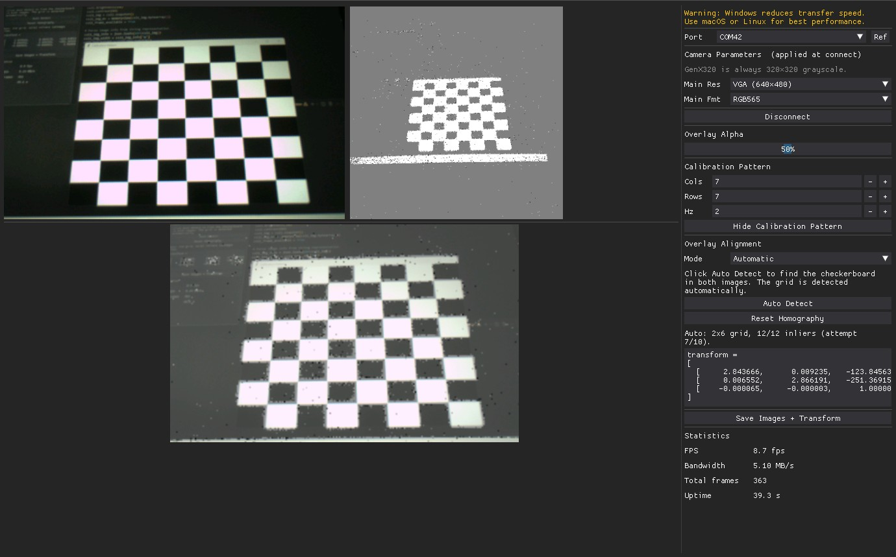

# GenX320 Overlay Calibration

A PC-side GUI that streams a color frame and a 320×320 grayscale histogram frame from the GenX320 event camera simultaneously, displays them side by side, and composites them into a calibrated overlay. A homography computed from point correspondences aligns the GenX320 onto the main camera's coordinate space for a pixel-accurate overlay.



## Platform Notes

macOS and Linux are recommended for the best GUI performance and throughput. On Windows, DearPyGui rendering can be noticeably slower, which may reduce frame rates. The camera script and serial protocol work on all platforms, but if you experience a sluggish UI or low frame rate, consider switching to a Mac or Linux machine.

On macOS and Linux the companion script's `read` method is automatically renamed to `readp` before execution (this is handled transparently by the PC script).

CRC is disabled by default on macOS and Linux for better USB throughput. It is enabled by default on Windows where it improves reliability. Override with `--crc`.

## Prerequisites

1. **OpenMV IDE** v4.8.4 or later.
2. **OpenMV Cam Firmware** v5.0.0 or later.
3. **Python dependencies:**

```
pip install dearpygui numpy pyserial Pillow openmv
```

Optionally install OpenCV for automatic checkerboard detection and better warp quality:

```
pip install opencv-python
```

Without OpenCV, the composite falls back to PIL bilinear resize and automatic alignment is unavailable.

## Running

```
python genx320_overlay_calibration_on_pc.py
```

The companion camera script (`genx320_overlay_calibration_on_cam.py`) is loaded automatically from the same folder. You can override any option from the command line:

| Flag | Default | Description |
|------|---------|-------------|
| `--port PORT` | *(GUI selector)* | Serial port to connect on |
| `--script PATH` | `genx320_overlay_calibration_on_cam.py` | MicroPython script to run on the camera |
| `--baudrate N` | `921600` | Serial baud rate |
| `--crc` | off (Linux/Mac), on (Windows) | Enable CRC on the serial protocol |
| `--quiet` | off | Suppress camera stdout |
| `--debug` | off | Enable verbose logging |
| `--benchmark` | off | Headless throughput benchmark (no GUI) |

## Benchmark Mode

Run without the GUI to measure raw USB throughput:

```
python genx320_overlay_calibration_on_pc.py --benchmark
python genx320_overlay_calibration_on_pc.py --benchmark --port /dev/ttyACM0
```

Prints at 10 Hz:

```
elapsed=3.2s    fps=9.1    bw=1.24 MB/s    frames=29
```

Press **Ctrl+C** to stop.

## GUI Overview

The window has two panes: a **left image area** and a **right control panel**.

### Image Area

- **Top row** — main color camera (left) and GenX320 histogram (right), each scaled to occupy half the available width at the same display height.
- **Bottom** — composite image: the GenX320 frame warped and blended onto the main frame. Without a homography the GenX320 is stretched to fill. With a homography it is perspective-warped to align. The composite is horizontally centered.

All images resize automatically when the window is resized.

### Camera Parameters *(applied at connect)*

These patch the on-camera script before it is executed. They are locked while connected.

| Control | Default | Description |
|---------|---------|-------------|
| Main Res | VGA (640×480) | Main camera resolution: QVGA, VGA, or HD |
| Main Fmt | RGB565 | Main camera pixel format: RGB565 or GRAYSCALE |

The GenX320 always outputs 320×320 grayscale in histogram mode — no additional controls are needed.

### Overlay Alpha

A slider from 0% to 100% controlling how much of the GenX320 frame is blended over the main frame in the composite. Defaults to 50%.

### Calibration Pattern

Opens a separate window displaying a flickering checkerboard (alternating between blank and checkerboard). Since event cameras only generate output in response to brightness changes, the flicker provides continuous edge events without requiring any physical movement. Configure **Cols**, **Rows**, and **Hz** to control the pattern, then click **Show Calibration Pattern**. Point the screen at both cameras. The pattern window is available regardless of alignment mode.

### Overlay Alignment

Computes a homography (perspective warp) that maps GenX320 pixel coordinates to main camera pixel coordinates for a geometrically correct overlay.

#### Manual Mode

Click **Pick Main Points**, then click 4 landmark points on the main camera image. Click **Pick GenX320 Points**, then click the same 4 landmarks in the same order on the GenX320 image. The homography is computed automatically once all 8 points are set. Numbered circles (1-4) are drawn on each image as you click to track progress.

> **Tip:** Spread the 4 points across the full frame for the most accurate warp. Avoid clustering all points in one region.

#### Automatic Mode

Click **Auto Detect** while a checkerboard is visible to both cameras. The detector tries up to 10 times with fresh frames, so the flickering pattern can produce different event snapshots across attempts.

The detector uses a blob-grid algorithm designed for event camera images: heavy median filtering removes event noise, Otsu thresholding binarizes the image, and contour detection finds the dark-square centroids. These are organized into a grid by clustering Y coordinates, and inner corner points are computed from 2x2 blocks of adjacent blob centers. The same algorithm runs on both the GenX320 and main camera images to ensure point correspondence, and a RANSAC homography is computed from all matched corners.

The grid size is detected automatically -- no manual corner count is needed. The status line reports the number of inliers after detection.

#### Shared Controls

- **Reset Homography** -- clears all points and the transform.
- **transform =** -- read-only copyable text box showing the computed 3x3 perspective matrix, ready to paste into firmware or a processing script.

### Save Images

Saves the current frames and transform to disk. The button label changes to **Save Images + Transform** once a homography has been computed.

- `genx320_overlay_main_<timestamp>.png` — main camera frame (RGB).
- `genx320_overlay_genx320_<timestamp>.png` — GenX320 histogram frame.
- `genx320_overlay_composite_<timestamp>.png` — composited overlay image.
- `genx320_overlay_transform_<timestamp>.txt` — the 3×3 homography matrix.

These files are excluded from git via `.gitignore`.

### Statistics

| Field | Description |
|-------|-------------|
| FPS | Frame pair rate (EMA) |
| Bandwidth | Combined USB data rate (MB/s, EMA) |
| Total frames | Cumulative frame pairs since connect |
| Uptime | Seconds since connect |
