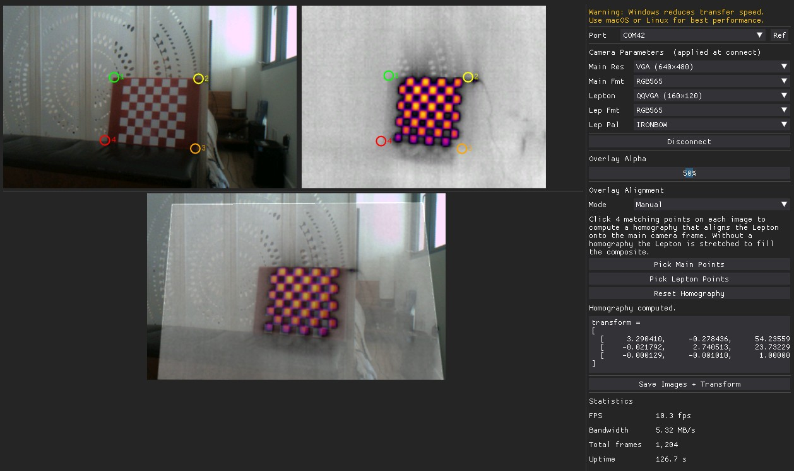

# Thermal Overlay Calibration

A PC-side GUI that streams a color frame and a FLIR Lepton thermal frame simultaneously from an OpenMV Cam, displays them side by side, and composites them into a calibrated overlay. A homography computed from point correspondences aligns the Lepton onto the main camera's coordinate space for a pixel-accurate overlay.


## Platform Notes

macOS and Linux are recommended for the best GUI performance and throughput. On Windows, DearPyGui rendering can be noticeably slower, which may reduce frame rates. The camera script and serial protocol work on all platforms, but if you experience a sluggish UI or low frame rate, consider switching to a Mac or Linux machine.

On macOS and Linux the companion script's `read` method is automatically renamed to `readp` before execution (this is handled transparently by the PC script).

CRC is disabled by default on macOS and Linux for better USB throughput. It is enabled by default on Windows where it improves reliability. Override with `--crc`.

## Prerequisites

1. **OpenMV IDE** v4.8.4 or later.
2. **OpenMV Cam Firmware** v5.0.0 or later.
3. **Python dependencies:**

```
pip install dearpygui numpy pyserial Pillow openmv
```

Optionally install OpenCV for automatic checkerboard detection and better warp quality:

```
pip install opencv-python
```

Without OpenCV, the composite falls back to PIL bilinear resize and automatic alignment is unavailable.

## Running

```
python thermal_overlay_calibration_on_pc.py
```

The companion camera script (`thermal_overlay_calibration_on_cam.py`) is loaded automatically from the same folder. You can override any option from the command line:

| Flag | Default | Description |
|------|---------|-------------|
| `--port PORT` | *(GUI selector)* | Serial port to connect on |
| `--script PATH` | `thermal_overlay_calibration_on_cam.py` | MicroPython script to run on the camera |
| `--baudrate N` | `921600` | Serial baud rate |
| `--crc` | off (Linux/Mac), on (Windows) | Enable CRC on the serial protocol |
| `--quiet` | off | Suppress camera stdout |
| `--debug` | off | Enable verbose logging |
| `--benchmark` | off | Headless throughput benchmark (no GUI) |

## Benchmark Mode

Run without the GUI to measure raw USB throughput:

```
python thermal_overlay_calibration_on_pc.py --benchmark
python thermal_overlay_calibration_on_pc.py --benchmark --port /dev/ttyACM0
```

Prints at 10 Hz:

```
elapsed=3.2s    fps=9.1    bw=1.24 MB/s    frames=29
```

Press **Ctrl+C** to stop.

## GUI Overview

The window has two panes: a **left image area** and a **right control panel**.

### Image Area

- **Top row** — main color camera (left) and Lepton thermal (right), each scaled to occupy half the available width at the same display height.
- **Bottom** — composite image: the Lepton warped and blended onto the main frame. Without a homography the Lepton is stretched to fill. With a homography it is perspective-warped to align. The composite is horizontally centered.

All images resize automatically when the window is resized.

### Camera Parameters *(applied at connect)*

These patch the on-camera script before it is executed. They are locked while connected.

| Control | Default | Description |
|---------|---------|-------------|
| Main Res | VGA (640×480) | Main camera resolution: QVGA, VGA, or HD |
| Main Fmt | RGB565 | Main camera pixel format: RGB565 or GRAYSCALE |
| Lepton | QQVGA (160×120) | Lepton resolution: QQVGA, QVGA, or VGA |
| Lep Fmt | RGB565 | Lepton pixel format: RGB565 or GRAYSCALE |
| Lep Pal | IRONBOW | Color palette applied when Lep Fmt is RGB565: IRONBOW or RAINBOW |

The palette combo is hidden when Lep Fmt is set to GRAYSCALE.

### Overlay Alpha

A slider from 0% to 100% controlling how much of the Lepton is blended over the main frame in the composite. Defaults to 50%.

### Overlay Alignment

Computes a homography (perspective warp) that maps Lepton pixel coordinates to main camera pixel coordinates for a geometrically correct overlay.

#### Manual Mode



Click **Pick Main Points**, then click 4 landmark points on the main camera image. Click **Pick Lepton Points**, then click the same 4 landmarks in the same order on the Lepton image. The homography is computed automatically once all 8 points are set. Numbered circles (1–4) are drawn on each image as you click to track progress.

> **Tip:** Spread the 4 points across the full frame for the most accurate warp. Avoid clustering all points in one region.

#### Automatic Mode

Place a heated checkerboard in the field of view of both cameras. Set **Cols** and **Rows** to the number of *inner* corners of the board (e.g. a 8×8 square checkerboard has 7×7 inner corners), then click **Auto Detect**.

The detector tries multiple preprocessing variants — CLAHE contrast enhancement, unsharp masking, Otsu binary thresholding, image inversion, and each individual RGB channel — to maximize robustness across different thermal palettes (IRONBOW, RAINBOW, etc.). If OpenCV 4+ is available, the saddle-point `findChessboardCornersSB` is tried first before falling back to the classic `findChessboardCorners`. All detected corners are used for the homography (RANSAC), giving much higher accuracy than 4-point manual picking.

The status line reports the number of inliers after detection.

#### Shared Controls

- **Reset Homography** — clears all points and the transform.
- **transform =** — read-only copyable text box showing the computed 3×3 perspective matrix, ready to paste into firmware or a processing script.

### Save Images

Saves the current frames and transform to disk. The button label changes to **Save Images + Transform** once a homography has been computed.

- `thermal_main_<timestamp>.png` — main camera frame (RGB).
- `thermal_lepton_<timestamp>.png` — Lepton frame.
- `thermal_composite_<timestamp>.png` — composited overlay image.
- `thermal_transform_<timestamp>.txt` — the 3×3 homography matrix.

These files are excluded from git via `.gitignore`.

### Statistics

| Field | Description |
|-------|-------------|
| FPS | Frame pair rate (EMA) |
| Bandwidth | Combined USB data rate (MB/s, EMA) |
| Total frames | Cumulative frame pairs since connect |
| Uptime | Seconds since connect |
